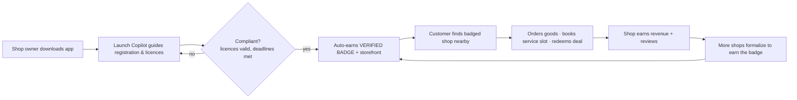
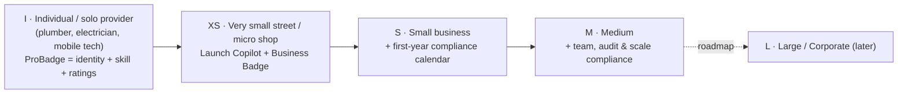
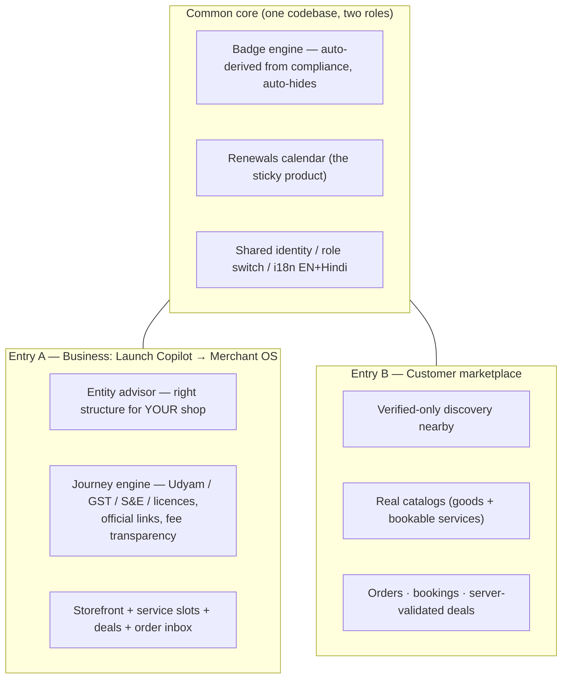
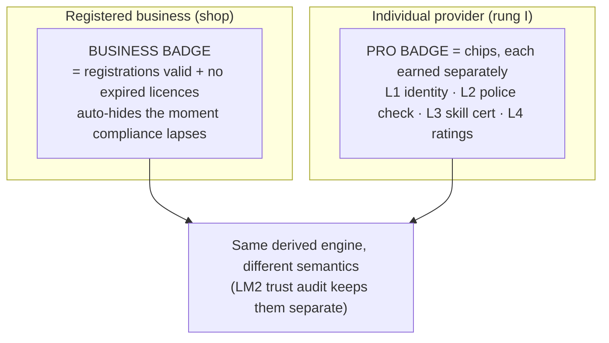
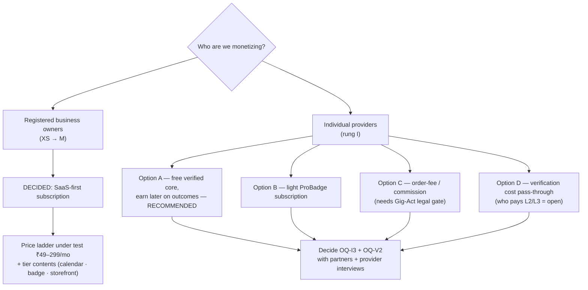
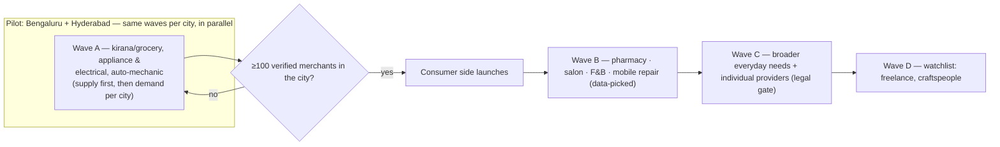

# India Business OS — Partner Brief (readable overview, v0.3+)

> **Purpose:** one readable document — with diagrams — that explains the whole business to a partner in ~30 minutes, and captures their input. Everything here traces to the detailed docs in this folder (map at the end).
> **Date:** 2026-09-08 · **Status:** Research + spec complete, pre-build · **Decision made:** SaaS-first monetization from business owners (2026-09-08).
> **How to use with partners:** read §1–§9 in order, pause at each decision in §13, and log reactions in `docs/partner-feedback-log.md`.
> **Evidence tags:** `[VERIFIED]` = ≥2 sources · `[ESTIMATED]` = single source/inference · research dates Sep-2026. Numbers without tags are from our own spec.

---

## 0. Where to start — suggested sequence

**Solo, in a hurry (15 min):** skim §1 (one-minute idea) → §3 (the loop) → §8 (money) → §9 (plan) → §13 (decisions). Skip to any section for detail; the doc is designed to be read in any order.

**Going over the ideas with partners — 4 short sessions, not one long one.** Each session = a slice of this brief + its source docs, ends in a small set of decisions, and gets logged in `docs/partner-feedback-log.md`.

| Session | What you go over | Sections + source docs | Decisions to resolve/endorse at the end |
|---|---|---|---|
| **1 · The idea** | The problem, the two-sided loop, who it serves, the trust engine | §1–§4, §6 · `vision.md` | Endorse: two-sided scope; badge = differentiator; pilot verticals |
| **2 · Market & why now** | Bundlers, near-misses (Pincode, Justdial×MSSIDC), whitespace | §7 · `research/competitive-map.md` + `market-deep-dive.md` | Does the whitespace hold for them? Is the Pincode read fair? |
| **3 · Business model** | SaaS-first decision, price ladder, individual-provider options A–D | §8 · `docs/pricing-model.md` | **OQ9** price band/tiers · **OQ-I3** provider option · **OQ-V2** who pays verification |
| **4 · Plan & execution** | Pilot, waves, gate, metrics, guardrails | §9–§11 · `docs/scope-brief.md` + `work-items.md` | **OQ3** hook · **OQ4** booking readiness · **OQ6/7** catalog/delivery · **OQ10** licence routing · **OQ1** PA partner · **OQ-I2** legal gate |

Rule of thumb: **don't move to session N+1 until session N's decisions are logged** — the loop, market, and money claims are the load-bearing ones (sessions 1–3); the plan (session 4) changes cheaply.

---

## 1. The idea in one minute

**India Business OS is a two-sided "super app" for Indian local commerce** where a shop owner goes from *starting* → *compliant* → *growing*, and their customers get *trusted, nearby* shops with orders, service bookings and genuine deals.

The bet, in one line: **compliance becomes a growth asset.** The shops this app helps formalize automatically become the verified supply that customers buy from — the badge is the bridge.

| Side | Who | What they get | What they give |
|---|---|---|---|
| **Entry A — Business** | Any India shop: kirana → medium | Launch Copilot (entity choice → registration → licences), renewals calendar, then verified badge + storefront + deals + orders | A fair monthly subscription (SaaS-first decision) |
| **Entry B — Customer** | Neighbours in the pilot city | Verified nearby shops, real catalogs, service bookings, genuine deals | Their trust and repeat business — **free to use** |

**Why now (market strip):** 6.3 Cr+ Udyam-registered MSMEs `[VERIFIED]` · 91% of grocery still goes through kirana `[VERIFIED]` · 40% of customers already ask shops for proof of registration `[VERIFIED]` · 47% wait for deals before buying `[VERIFIED]` · local discovery has no trust layer (Justdial broken, Google has no loop, ONDC has no badge).

---

## 2. The problem — two sides, one gap

**Shop owners:** fragmented govt portals (MCA/GST/Udyam/FSSAI/state trade licences), each a separate login, English-heavy, no cross-portal guidance. Filing marketplaces sell one-off events, then nobody reminds them about the next ROC filing / licence renewal. **Result:** fines, fear, staying informal.

**Customers:** they *want* to trust local shops — but can't tell genuine from fake ("Is the electrician licensed? Is this shop really registered?"). Justdial burned trust with fake leads; Google's new "Verified" badge (2025) covers only *paying* Local-Services advertisers — organic local discovery still shows shops with no live-compliance signal; delivery apps show speed, not trust.

**The gap nobody owns (whitespace):** *no Indian platform ties a live compliance state to consumer discovery.* That is exactly the layer we build.

---

## 3. The loop (why it compounds)

**Why incumbents can't half-copy it:** a marketplace that gates its supply on compliance *loses inventory*; Google's own step (Google Verified, 2025) stops at paid Local-Services advertisers and has no discovery loop; Pincode (PhonePe) tried the customer side with **no compliance signal**, competed on speed against dark stores, and was wound down in Dec-2025 — the CEO called it "a distraction." Their retreat is directional evidence *for* our differentiator: we don't race on delivery speed; the badge is the wedge. `[VERIFIED — TechCrunch, Dec-2025]`

---

## 4. Who it serves — one profile that grows with the owner

One codebase, one account — **a phone can hold both roles** (owner *and* customer). Trust compounds in place: an individual who later opens a shop keeps their verified history and adds licence compliance — the profile never restarts. Vertical differences (kirana vs appliance repair vs salon) are **config packs**, never separate products.

---

## 5. What we build — two entry surfaces on one core

**MVP boundaries:** IN = both experiences above, Bengaluru × {kirana/grocery, appliance & electronics, electrical, auto-mechanic}. OUT = wallet/funds holding (never), delivery fleet, billing/ledger suites (Vyapar/OkCredit's red ocean), ads/paid leads (Justdial's corpse), consumer fees.

---

## 6. The trust engine — two badges, not one

Shops are verified on *licences*; individuals have no licences, so their trust is **who they are + what they can do + how they behave**. In the pilot, individual tradesmen ride the shop profile with a "mobile service" flag; the full ProBadge person-pack is planned for wave C behind a legal gate.

---

## 7. Market scan — who exists, what they bundle, and the gap

**A. Filing marketplaces (old Entry-A competition):** Vakilsearch, Clear, IndiaFilings, LegalWiz — sell one-off registrations/filings at ₹399–1,500; no lifecycle, no reminders, no consumer side. `[VERIFIED]`

**B. Merchant bundlers (NEW Entry-A competition — the real watch):** apps folding registration into tools owners already use:

| Player | Bundles | Gap vs us |
|---|---|---|
| PhonePe Business × SIDBI | Payments + **in-app Udyam registration** (~4.5 Cr merchants) `[VERIFIED]` | Transactions, not lifecycle; no consumer badge loop |
| Tide India | Business account, GST invoicing, Udyam, website builder, loans `[VERIFIED]` | No compliance calendar, no badge discovery |
| GST Suvidha Kendra (GSK) | 400+ services incl. registrations, filings, digital marketing `[VERIFIED]` | Service list, not guided lifecycle; franchise model |
| Cashlo · IRIS Peridot · InDApp (govt) | Shopkeeper utilities / MSME scheme bundles | Same shared gap |

**C. Two-sided near-misses (closest to our shape):** **Justdial × MSSIDC** shows licence-verified tags to buyers — but static, partnership-fed, no loop, and Justdial's trust is broken. **Pincode (PhonePe)** had both sides — no compliance signal, lost on speed, shut down Dec-2025. **ONDC** is a rail, not a moat — no trust layer.

**Whitespace conclusion:** the *combination* — formalize → badge → verified discovery → buy → more formalize — is unoccupied. Uniqueness has a shelf life (execution speed), so validation and pilot speed are the moat.

---

## 8. Business model & monetization

**Decision (2026-09-08): SaaS-first, paid by business owners.** Recurring subscription for the merchant OS (Launch Copilot journeys + renewals calendar + verified badge/storefront/deals). The customer side is **free** and is the growth engine — never consumer fees, never per-lead charges.

**Price anchors (research, `[VERIFIED]`):** owners already pay ₹500–4,000/yr for serious billing tools; Vyapar ≈ ₹629–1,799/yr; OkCredit = ₹0 → **the ₹0 anchor is the core pricing risk**, so the subscription must sell calendar value (fines/filings avoided) + growth value (badge → orders), and interviews test the ladder.

**Why individuals get a different set:** 40% of gig workers earn <₹15k/mo `[VERIFIED]`; today's industry monetizes them with hated lead fees (₹40–250/lead) and ₹3,000/mo packs `[VERIFIED]`; new entrants (ProNearMe, HelpRush) signal zero-upfront/outcome-only `[VERIFIED]`. Full analysis: `docs/pricing-model.md`.

---

## 9. Where we play first — pilot, waves, and validation

**Pilot cities: Bengaluru (KA) and Hyderabad (TS) — both from day one, in parallel.** City = a config pack (licence sets, portals, municipality) on the same core — two cities is the earliest proof of that design. Bengaluru post-BBMP split: 5 corporations, 369 wards (`research/bengaluru-pilot-map.md`); Hyderabad via GHMC + Telangana regime — **partial research pass done 2026-09-08** (`research/hyderabad-pilot-map.md`; incl. Telangana Gig Workers Act 2026 now in force, 1–2% levy; W35b denominator pass still pending). Each city's consumer side opens only at its own ≥100 verified gate. ⚠️ Parallel = double the supply-ramp/field effort: budget founder capacity (or a per-city field partner) before starting both.

**Validation before scale (W35–W40, tooled):** street-walk licence ground-truth → ≥10 merchant + ≥10 consumer interviews (hypotheses H1–H6: which hook converts — badge, deals or bookings; price ladder) → ≥100-verified gate → pilot launch. First executable step is already scripted: `scripts/pilot-denominator.py`.

---

## 10. Metrics that matter (pilot targets)

| Metric | Target |
|---|---|
| Merchant funnel: quiz → registered ≤45d → D30 → clarity CSAT → NPS | as speced (SM1–SM6) |
| Discovery view → storefront open (CM1) | ≥40% |
| Storefront → order placed (CM2) | ≥15% |
| Service booking requested → confirmed (CM5) | ≥50% |
| Orders with a valid deal by month 3 (CM6) | ≥10% |
| No consumer-facing badge on an out-of-compliance shop (LM2) | 100% (weekly audit) |

---

## 11. Non-negotiables (guardrails)

- **Never holds funds** (RBI PPI) — payments via payment-aggregator redirect only.
- **Guides, never files** — the app directs to official portals; not a filing intermediary.
- **Badge auto-hides** on non-compliance — trust is the product, never gamed.
- **No paid-lead selling, no fake leads** — monetize outcomes, never exposure (Justdial's lesson).
- **Never monetize consumers** — customer side free.
- **Deals server-validated** — no fake-MRP claims; deals misuse loses deal capability, not the badge.
- **No billing/ledger suites** — Run layer is a free/cheap red ocean; not our wedge.
- **No Aadhaar storage** — verify via eKYC responses only; DPDP consent; docs stay issuer-signed in DigiLocker.
- **Enablement tone, never fear** — compliance messaging helps owners win, not scares them.

---

## 12. Evidence discipline (why partners can trust the numbers)

Every claim in the research docs carries `[VERIFIED]` / `[ESTIMATED]` / `[VERIFY at build]`, with sources and dates listed at the bottom of each research file. Untagged numbers are our spec assumptions. Research dates: Sep-2026.

---

## 13. Decisions to check with partners

**Already decided — please endorse or challenge:**
- Two-sided product (Entry A + Entry B on one core). ✅
- SaaS-first subscription paid by business owners; consumer side free. ✅ (2026-09-08)
- Compliance-badge discovery as the differentiator; no billing/ledger, no wallet, no paid leads. ✅
- Consumer launch gated on ≥100 verified merchants **per city**; pilot = Bengaluru + Hyderabad **in parallel** × 4 verticals. ✅

**Open — where partner input genuinely changes the plan:**

| # | Decision | Options / our current lean | Evidence | Partner view (date/name) |
|---|---|---|---|---|
| OQ3 | Which hook converts first: badge, deals or bookings? | Lean: badge + deals for grocery; bookings for services (test in interviews) | H1–H6 scripts ready | |
| OQ9* | Monthly price band + what tiers include | Ladder test ₹49–299/mo; lean: calendar + badge/storefront bundled | Vyapar ₹629–1,799/yr anchor | |
| OQ-I3 | Individual-provider monetization (rung I) | Lean: **Option A** — free verified core → outcome-linked later | ProNearMe/HelpRush signals | |
| OQ-V2 | Who pays verification costs (L2 ₹50–200, L3) | Lean: launch subsidy for density, then pass-through | Cost rails ₹0.15–₹500 | |
| OQ-I1 | Do pilot tradesmen need ProBadge in v0.3 or ride shop profile w/ mobile flag? | Lean: ride shop profile in pilot | Gig research §4–5 | |
| OQ-I2 | When do we become a "platform" under KA Gig Act 2025? | Legal review before individual matching | Act in force 30-May-2025 | |
| OQ1 | Payment-aggregator partner & fee economics | TBD | RBI PA model | |
| OQ4 | Do mechanics/appliance shops keep calendars (slot vs call-first)? | Lean: slot model with confirm | Interview Q11 | |
| OQ5 | Deal + no-show rules | Server-validated; no-show policy TBD | Deal-integrity guardrail | |
| OQ6/7 | Catalog sourcing & delivery mix for pilot | Lean: assisted manual entry; pickup/self-delivery/POD | ONDC = future rail, not MVP | |
| OQ10 | Licence-portal routing — Bengaluru (5 corporations) + Hyderabad (GHMC/TS) | Verify city-level before config freeze | Pilot map docs | |

\* OQ9 model (SaaS-first) is decided; price band + tier contents remain open.

**Where we most need partner help:** distribution/supply ramp in Bengaluru (§9), CA/legal read on the Gig-Act gate and licence routing, and a second opinion on the SaaS price ladder vs the ₹0 anchor.

---

## 14. Capture partner input

Use **`docs/partner-feedback-log.md`** — one entry per meeting: the decisions reviewed, the partner's view on each (from §13), verbatim quotes worth keeping, and resulting actions. Copy that file per partner if you want a separate log each.

---

## 15. Map of supporting docs (detail lives here)

| Read for… | File |
|---|---|
| Umbrella vision, personas, risks | `vision.md` |
| MVP scope IN/OUT, metrics, open questions | `docs/scope-brief.md` |
| Marketplace cold-start/liquidity/trust audit + gaps | `docs/marketplace-audit.md` |
| **40 real-time role journeys & flows (8 per actor: customer, individual, small, medium, large)** | `docs/journey-flows.md` |
| **Monetization decision + individual options** | `docs/pricing-model.md` |
| Modules, config packs, waves A–D | `docs/module-map.md` |
| Entities, state machines, API, screens | `docs/domain-model.md` · `api-contract.md` · `screen-inventory.md` |
| Story map W1–W40, validation scripts, pilot playbooks | `docs/work-items.md` · `validation-interviews.md` · `pilot-recruitment-playbook.md` |
| Market & competitors (bundlers, near-misses, pricing) | `research/competitive-map.md` · `market-deep-dive.md` |
| Individuals & trust rails (ProBadge L1–L4, KA Gig Act) | `research/individual-providers-gig.md` · `individual-verification-trust.md` |
| Bengaluru pilot unit + W35 tooling | `research/bengaluru-pilot-map.md` · `scripts/pilot-denominator.py` |
| Hyderabad pilot research stub (GHMC/TS) | `research/hyderabad-pilot-map.md` |
