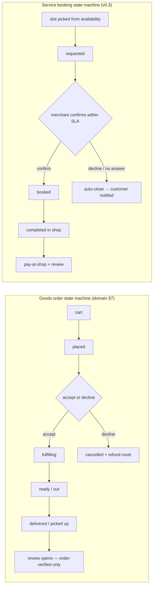
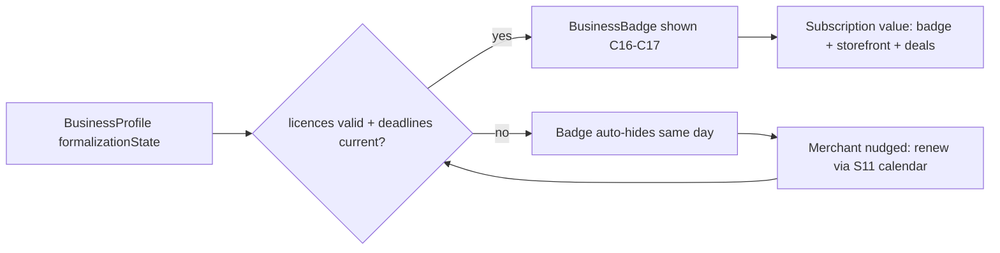
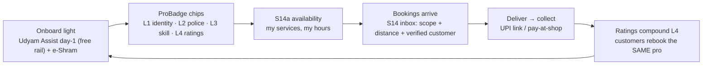
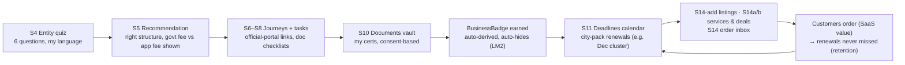
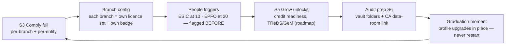
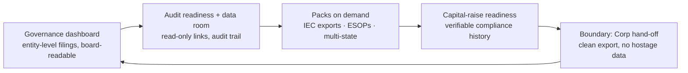

# Role Journeys & Real-Time Scenarios — how each actor uses the OS (partner & design reference)

> **Date:** 2026-09-08 · **Version:** v0.3-aligned · **Purpose:** detailed, screen-level journeys for the five actor types — **customer · individual service provider · small business · medium business · large business** — each with **8 realistic scenarios (40 total, research-cited)**. Written for partner reviews, UX design and story-mapping.
> **Grounding:** `docs/stage-model.md` (ladder I→XS→S→M→L→Corp, stages S1–S6, matrix F1–F7) · `docs/screen-inventory.md` (screens S1–S24) · `docs/domain-model.md` (order/booking/deal state machines) · `vision.md` personas · research files (gig earnings, licence calendars, trust stats). Diagrams render on GitHub (Mermaid).
> **Evidence tags** follow folder discipline: `[VERIFIED]` ≥2 sources · `[ESTIMATED]` single source · untagged = spec assumption. "What he expects" is our expectation model to validate in H1–H6.

## 0. Actor map & how to read a scenario

| Actor | Ladder rung | Badge/verification | Main screens | Monetization |
|---|---|---|---|---|
| **Customer** (Priya-type) | — | Sees BusinessBadge / ProBadge chips; consumer = phone-verified + order history | C16–C24 (discovery→storefront→cart/booking→pay→track→review) | Free (growth engine) |
| **Individual provider** (Imran-type) | I | **ProBadge** L1 identity · L2 background · L3 skill · L4 ratings (wave C; pilot = rides shop "mobile service" flag, OQ-I1) | S1–S7 (light), S14a availability, S14b deals, S14 inbox | **₹0 free verified core (decided 2026-09-08)** — no subscription/commission; govt verification fees (OQ-V2) |
| **Small business** (Sunita kirana-type) | XS → S | **BusinessBadge** = registrations valid, no expired licences (auto-hide) | S1–S15 full Launch Copilot + merchant OS | SaaS-first subscription (decided) |
| **Medium business** (Meera-type) | S → M | BusinessBadge per branch/entity; compliance calendar full | S3–S15 + branch config, people triggers, audit prep | SaaS-first (higher tier / per-branch) |
| **Large business** (Arvind-type) | L (roadmap) | Governance & audit readiness; not MVP | S6-scale packs (board, ESOPs, IEC, data room) | SaaS-first enterprise (Phase 3) |

**Scenario template:** Persona+context → Trigger → Journey (screen-level steps) → **What he expects in detail** → What the product does / outcome · Metrics touched · Edge case.
**Screen ids:** customer-journey steps are written as **C#** for readability; officially they are the consumer screens **S16–S24** in `docs/screen-inventory.md` (C16=S16 discovery … C24=S24 nearby-deals). Business steps use the real ids **S1–S15** (incl. S14a availability, S14b deals, S14 order inbox; listings = S14-add per work-item W18).
**Guardrails that constrain every scenario:** never holds funds (PA redirect / pay-at-shop) · order-verified reviews only · badge auto-hides · no per-lead charges · consumer side free.

**Economics at a glance (research-cited — deepens every scenario below):**

| Actor | Real-world economics the scenarios assume | Source |
|---|---|---|
| Customer | Grocery AOV ₹100–200 · 40% of customers ask shops for proof of registration · 47% wait for deals before buying · 88% trust online reviews ~as much as word-of-mouth · home services >98% offline | `market-deep-dive.md` D4/D3 · `two-sided-wants-gaps.md` · `individual-providers-gig.md` I3 `[VERIFIED]` |
| Individual provider | Platform gig ≈ ₹138/hr vs ₹54 informal (2.5×) · **40% earn <₹15k/mo** · all-cohort avg ≈ ₹32k/mo; UC avg net ₹26–34k/mo (top earners need hours, not rates) · transport ₹9–12k/mo · women earn same monthly as men despite higher hourly (fewer hours/safety) · industry lead fees ₹40–250 + ₹3,000/mo packs are hated · new entrants signal zero-upfront (ProNearMe) & tiered fees (HelpRush 20/12/8%) | `individual-providers-gig.md` I1/I3 `[VERIFIED]` |
| Small business (XS→S) | Kirana holds 91% of grocery · MSMEs: 46.2% fully offline, 53.8% use ≥1 tool · billing tools ₹0 (OkCredit) – ₹629–1,799/yr (Vyapar) · compliance bought as events ₹500–15k · GST optional <₹40L goods / ₹20L services · S&E/trade licence = state regime (KA vs TS; TS S&E ₹100–10k+/yr by headcount) | `market-deep-dive.md` D1/D4 · `stage-model.md` §0 · `hyderabad-pilot-map.md` `[VERIFIED]` |
| Medium business (S→M) | ESIC at 10+ / EPFO at 20+ employees · tax audit ₹1Cr (₹10Cr digital) · GSTN active ~1.52Cr · statutory audit for Pvt Ltd; branches → per-branch licences; credit = thin-file pain; TReDS/GeM rails | `stage-model.md` §0/§1 · `market-deep-dive.md` D4 `[VERIFIED]` |
| Large business (L, roadmap) | MSME Medium ≤₹125Cr/₹500Cr; beyond = listed/corp · needs: board governance, statutory audit, IEC exports, ESOPs, DPDP, capital-raise data rooms | `stage-model.md` §0 · `vision.md` §5 `[VERIFIED — MSME Apr-2025 criteria]` |

---

## 1. Shared micro-flows (used by all scenarios)

---

## 2. Customer — "I want a shop I can trust, nearby, right now" (Priya-type)

**Master flow (customer journey — one diagram):**

```mermaid
flowchart LR
    A["S16 Discover<br/>verified-only filter, badge + deal chips"] --> B["S17 Consider<br/>storefront: badge, licence summary, reviews"]
    B --> C["S18 Browse<br/>goods listing or bookable service"]
    C --> D["S19 Order/Book<br/>cart → UPI intent · service → slot + request"]
    D --> E["S20 Pay (UPI redirect)<br/>goods · bookings = pay-at-shop"]
    E --> F["S21 Track<br/>accept → pack → ready / tech on way"]
    F --> G["S22 Review<br/>order-verified only"]
    G --> H["Repeat — same shops, saved lists<br/>(CM4 ≥25% repeat)"]
```

**Expectations (cross-scenario):** proof that is *current*, not a sticker · honest prices incl. GST · genuine deals (no inflated-MRP tricks) · booking = confirmed time, not "call and hope" · know where my order is · easy re-order · my data stays minimal.

### C1 — Sunday grocery with a genuine deal (verified kirana)
- **Persona:** Priya, 34, Bengaluru, UPI-native; feeds family of four.
- **Trigger:** Saturday evening; kirana list ready; sees a nearby-deals notification (C24).
- **Journey:** (1) Opens C16 discovery → verified-only filter ON by default → badge chips + "₹20 off on ₹200" tag on a kirana 600 m away. (2) Opens C17: badge = "GST-registered · trade licence valid to 31-Dec" + 4.6★ from 38 order-verified reviews. (3) C18: dal ₹X (GST-inclusive, stock "in shop"), adds 9 items. (4) C19: deal auto-attached and server-validated; delivery = self-pickup tomorrow 10am. (5) C20 UPI via PA redirect — money goes to shop, never the app. (6) C21: "accepted → packed → ready".
- **What she expects in detail:** the badge to mean *current* compliance, not marketing; final price = listed price (no surprise GST at counter); deal applies without haggling or "offer expired" games; pickup not waiting in queue (order ready when she arrives); same list next week = one tap re-order.
- **Outcome:** order completed; C22 review (order-verified). Metrics CM1→CM4. **Edge:** deal expired mid-cart → app re-prices at checkout and tells her why (server-validated, never silently).

### C2 — AC service booked to a slot, not "we'll come sometime"
- **Persona:** Ramesh, 58, Hyderabad; 2 ACs; burned before by "technician will come" no-shows.
- **Trigger:** AC cooling weak; wants it checked before summer heat.
- **Journey:** (1) C16 → vertical "appliance & electronics" → nearby badged shops with **service listings**; picks a shop 1.2 km away with 4.8★. (2) C17 storefront → "Services" tab shows "AC service — ₹499, ~45 min". (3) C18 service detail → C19 **slot picker**: next-7-days grid from the shop's availability (S14a) → picks Sat 11:00–12:00, notes "bedroom AC, weak cooling". (4) Booking = **request → merchant confirms** (pay-at-shop default). (5) C21: confirmed → "technician on the way" on Saturday.
- **What he expects in detail:** a real confirmed time window; technician identity visible (name/photo/phone-verified — both-ways trust); price upfront or clear "after inspection" basis, no hidden parts markup; "pay only when done"; if the shop can't make the slot, notice + easy reschedule, not silence.
- **Outcome:** service done, paid at shop (₹499 + part if needed, receipted); C22 review. Metrics CM5 (confirm ≥50%), CM4 repeat. **Edge:** no-show by merchant → rating + auto-flag + founder-mediated 48-hr SLA (marketplace-audit Gap B).

### C3 — Same-day electrician when the board sparks
- **Persona:** Kavya, 29, Bengaluru; home alone with a toddler; needs speed **and** trust (stranger into home).
- **Trigger:** tripping breaker + burnt smell; urgent.
- **Journey:** (1) C16 → electrical vertical → filter "available today" → badged shops; picks nearest (400 m). (2) Calls via C17 (phone shown only with merchant consent) — reaches the owner directly, not a call centre. (3) Books a same-day slot (C19) + "emergency" note; merchant confirms in 6 min (S14 inbox).
- **What she expects in detail:** someone who can actually come today (availability = real, not stale); verification that the electrician is **licensed for electrical work** (L3 skill cert where required) — she is letting a stranger in with her child home; clear charge for the visit before he comes; a way to know the person at the door matches the profile (photo match); if it's a known scam pattern (cash-only pressure), the app's trust rails to still protect her.
- **Outcome:** visit same-day, fault fixed, paid at shop, review left. Metrics CM5/CM2. **Edge:** Kavya's case triggers "home-entry category → L2 police verification shown" on the merchant profile (OQ-V1) — visible two-way accountability.

### C4 — First order from a newly formalized shop (the badge moment)
- **Persona:** Anjali, 41, Hyderabad; skeptical of "justdial-style" claims; Telugu-first.
- **Trigger:** a local shop she passed for years suddenly appears online as "Verified".
- **Journey:** (1) C16 in Telugu (i18n) — the shop shows badge + "recently verified". (2) C17: licence summary + "this shop completed registration through the app" (enablement framing, never "now compliant or else"); small first order to test: ₹80 groceries. (3) C20 UPI; pickup.
- **What she expects in detail:** the badge to mean the shop actually has documents today (she is among the 40% who ask for proof `[VERIFIED]`); seeing what *type* of licence (GST vs S&E vs FSSAI) so she can judge for her need; her small trial order not to be treated as unimportant; and if the shop is later found out-of-compliance, the badge disappears (LM2 audit) — she wants to know that promise is real.
- **Outcome:** first order OK; converts to repeat via CM4. **Metric:** LM1 (order from app-onboarded merchant ≤90 days).

### C5 — Weekly routine: re-order, addresses, and trust that compounds
- **Persona:** Priya (again), after 6 weeks of use.
- **Trigger:** Tuesday morning routine.
- **Journey:** (1) C23 profile: saved address + "weekly list" → one-tap reorder from same 2 shops. (2) C21 tracking; C24 deals feed shows a repeat-customer offer from the appliance shop she used. (3) Occasionally books the mechanic for her scooter (same slot flow as C2).
- **What she expects in detail:** the app to remember her shops without her managing contacts; no spammy "deals" (only genuine, server-validated); her review history to matter (merchants who serve her well get her repeat business — she expects the platform to keep bad actors out so her trust isn't betrayed); Hindi/Kannada/Telugu switch never resets her session.
- **Outcome:** CM4 ≥25% repeat; customer-side retention = why business owners pay (SaaS value). **Edge:** if a beloved shop's badge hides (licence expired), Priya is told *why* in neutral language and the shop can fix it — compliance as enablement, not punishment.

---

### C6 — Washing-machine repair with an 'after-inspection' parts approval
- **Persona:** Kavya, 29, Bengaluru; her earlier electrician visit (C3) worked; now the washing machine leaks.
- **Trigger:** repair needed; she fears the classic "₹500 visit becomes ₹4,000 surprise."
- **Journey:** (1) Books the badged appliance shop (C2-style slot). (2) Technician inspects → instead of a verbal quote, shop sends an **in-app parts quote**: "drain pump ₹850 + labour ₹250 · approve to proceed". (3) She approves in-app; parts fitted; total = quoted ₹1,100, paid at shop; C22 review records "quote honoured".
- **What she expects in detail:** never to authorize work without a written number (she was charged ₹4,000 for a "small leak" once — the research on trust barriers in home services is real: letting a stranger in + unclear pricing is the category's core fear `[VERIFIED — individual-verification-trust.md §1]`); the quote to be itemized (part vs labour); her approval to be a 1-tap digital record she can keep; no "while I'm here" unapproved upsells.
- **Outcome:** transparent repair → repeat booking + 5★. **Metric:** CM4 repeat; this loop is the trust flywheel. **Edge:** she declines the quote → shop marks visit "no-work done" → she pays only the agreed visit fee (policy input for OQ5).

### C7 — One phone, two hats (shop owner who also buys)
- **Persona:** Rohan, 32, Hyderabad; runs a small appliance shop (Entry A) and shops at a neighbouring kirana (Entry B).
- **Trigger:** same phone number, two roles — the design premise (one codebase, role switch S15).
- **Journey:** (1) Morning: role = business (S3 dashboard) → confirms 2 orders in S14, updates S14b deal. (2) Evening: role = customer (S15 switch) → orders groceries from the kirana (C1-style), pays UPI. (3) Both histories stay separate; his shop's customer reviews never mix with his own shopping.
- **What he expects in detail:** switching roles in ≤2 taps without logout; strict separation (his customers' data vs his own orders — he would never want a customer to see his shopping, and vice versa); his merchant earnings summary to stay private from his consumer profile; Hindi+Telugu UI in both hats.
- **Outcome:** dual-role usage proves the shared-core architecture (one identity, two surfaces, no duplication — vision §3). **Edge:** what happens to his own shop's listing when he shops? He must never see his own badge in consumer search as a "nearby verified shop" ranked to himself (dedupe by phone).

### C8 — The household that orders for someone else (senior + shared list)
- **Persona:** Priya (34) and her father-in-law (68, Hyderabad); he can't use the app; she manages the home remotely.
- **Trigger:** parents' pantry runs low; Priya is at work 15 km away.
- **Journey:** (1) S23 household profile: Priya adds a shared address + second member. (2) She orders from the kirana near *their* home (discovery by saved address, C16 geo = delivery address not her phone location). (3) Pickup/small-delivery handled by the shop; her father pays cash-on-pickup (POD — order shows "paid at pickup"). (4) Order confirmation message arrives on his phone in Telugu ("your order is ready at Sri Kirana").
- **What she expects in detail:** ordering for a different address without GPS games; a light notification for the senior (no app needed — WhatsApp/SMS `[H5 — WhatsApp is the workflow centre]`); cash/pay-at-shop to remain an option (seniors won't scan UPI); trust that the shop she picked is verified — she is choosing for someone who can't verify himself.
- **Outcome:** family-wide repeat (CM4 across household); senior-friendly reach = the "47% not fully online" bridge `[ESTIMATED — MSME digital-divide analog]`. **Edge:** shared-address privacy → household members see only order status, never payment details unless shared (consent-based).

## 3. Individual service provider — "I have skills, not a shop" (rung I, ProBadge)

**Master flow (individual provider — one diagram):**

**Monetization note:** **decided 2026-09-08 — rung I is ₹0**: free verified core (ProBadge chips), no subscription, no commission, no lead fees; the value is the badge that *travels* + predictable earnings (industry lead fees ₹40–250 are the anti-pattern `[VERIFIED]`). Only open cost: govt verification fees for home-entry categories (OQ-V2). Graduation I→XS+ (shop/premises/staff) = the first pay moment. Legal: matching individuals = aggregator duties under KA Act 2025 and TS Act 2026 (OQ-I2 gate, both cities `[VERIFIED 2026-09-08]`).
**Expectations (cross-scenario):** no upfront cost or lead fees; badge is *mine* and moves with me; steady, predictable demand (not bidding); clear job scope before travel; safe both-ways (customers verified too); earnings visible.

### I1 — Mobile AC technician onboards and gets his first booked jobs
- **Persona:** Imran, 29, Hyderabad; AC/refrigeration tech; currently earns ₹25–35k/mo via informal referrals and a big platform that takes a cut `[research — UC-class avg net ₹26–34k/mo]`.
- **Trigger:** wants his own customers; tired of lead packs that charge ₹40–250 whether or not the job converts `[VERIFIED — gig research]`.
- **Journey:** (1) App role = business → "I provide services, no shop" → light onboarding (S1–S3): Udyam Assist (free, credit gate) + e-Shram UAN `[VERIFIED rails]`. (2) **ProBadge L1** (Aadhaar eKYC ~₹0.15/check) + **L4** (ratings from order-verified jobs); L2/L3 deferred for his category in pilot (OQ-I1 ride). (3) S14a availability: sets "AC service Wed–Sun, 10–7"; service price basis "₹350 visit + parts". (4) First bookings arrive via S14 inbox with customer name/address/photo (two-way verification).
- **What he expects in detail:** zero signup cost and no per-lead charge (decided: ₹0 free core); to see the job's scope + distance before accepting (his travel ₹9–12k/mo is real `[VERIFIED — gig research]`); on-time, predictable demand — not 3 calls Tuesday and silence Friday; to be paid reliably and visibly (UPI settlement records); his ProBadge to be *his* asset he can show even outside the app.
- **Outcome:** 4 booked jobs week 1; reviews build L4; earnings predictable. **Metric:** CM5 confirm; SM funnel (light I-path). **Edge:** a customer who books and never shows → no-show policy (OQ5) protects his time.

### I2 — Electrician adds a police-verified badge to enter homes
- **Persona:** Ravi, 33, Bengaluru; licensed (ITI electrical); does residential calls through a shop's "mobile service" flag in the pilot.
- **Trigger:** customers increasingly ask "are you verified?" before letting him in.
- **Journey:** (1) Adds **L2** background check (state police verification, ₹50–200, 15–30 days `[VERIFIED]`) + **L3** ITI certificate via DigiLocker (issuer-signed, no copies stored). (2) Profile now shows chips: "Govt ID verified · Police check · ITI certified · 4.7★ (61 jobs)". (3) C17-facing profile shows chips to customers; rebooking rate climbs.
- **What he expects in detail:** verification to be affordable and once — not re-pay per platform; his documents to stay his (DigiLocker issuer-signed refs, never stored copies — DPDP); a re-verification cadence that doesn't punish him (RBI-KYC analogy, no "adverse action on ratings alone" `[VERIFIED — KA Act]`); visible benefit: he can name his rate when trust is proven.
- **Outcome:** L2 chip live → higher confirm rate. **Metrics:** CM5, repeat. **Edge:** L2 takes 15–30 days → app shows "background check in progress" so customers still see partial, honest chips (never a fake full badge).

### I3 — Beautician at home, safety both ways
- **Persona:** Farzana, 27, Hyderabad; home-visit beautician (women clients); safety + cancellations are her #1 worry `[VERIFIED — women gig research: safety/transport constraints]`.
- **Trigger:** wants women-only, pre-verified clientele; refuses anonymous call-outs.
- **Journey:** (1) ProBadge L1+L2 (home-entry category → L2 default at launch per OQ-V1 lean). (2) Sets "women customers only" + service area. (3) **Both-ways trust:** customers she serves are phone-verified with order history; she sees the same before accepting (mirror of C3 — two-way, unlike one-way platform surveillance).
- **What she expects in detail:** never to enter a home where the customer isn't similarly verified; evening slots she chooses (safety-driven schedule); a grievance path that works *for her* (not just for customers); no location pings on every job (verify at onboarding + risk-triggered spot checks, not surveillance `[VERIFIED — APC critique]`); earnings record for her own planning.
- **Outcome:** consistent women-only bookings; her reviews show reliability. **Edge:** a flagged customer → she can decline with a visible reason (no adverse action on either side from a single rating).

### I4 — Home kitchen formalizes with FSSAI and sells meals as a deal
- **Persona:** Lakshmi, 45, Bengaluru; cooks 20 tiffin meals/day from home, cash-only, word-of-mouth.
- **Trigger:** neighbours ask for delivery + advance payment; she wants to grow without risk.
- **Journey:** (1) Person-pack variant (wave C): FSSAI home-kitchen registration `[VERIFIED — home kitchen reg.]` + Udyam. (2) Lists meals as **goods with daily stock** + a "subscribe 20 meals" deal (S14b). (3) UPI payment links replace cash-in-hand; customers see her FSSAI badge.
- **What she expects in detail:** the *smallest* licence step that makes her legal (no forced premises S&E — home exemption `[VERIFIED]`); advance orders without holding anyone's money herself beyond UPI; a deal that rewards regulars without wrecking her margins (server-side caps); Telugu/Hindi guidance, not English forms.
- **Outcome:** 20 → 40 meals/day over 3 months; formal → eligible for credit later (Udyam). **Metric:** CM6 deals share. **Edge:** F&B vertical deferred in MVP — this is wave-C config, listed to show the ladder's reach.

### I5 — Mobile mechanic without a shop (the pilot's grey-zone case)
- **Persona:** Santosh, 38, Hyderabad; comes to customers' homes for two-wheeler repair; no fixed premises.
- **Trigger:** pilot wave A auto-mechanic — but he has no shop licence to verify.
- **Journey (OQ-I1 default):** rides the **shop profile with a "mobile service" flag** in the pilot (a partner mechanic shop attests/roots him) — he is listed under that shop's badge until ProBadge person-pack ships (wave C). S14a availability at customer locations; bookings confirm the *location of the job*, not a shop address.
- **What he expects in detail:** to not be shut out of the pilot because he lacks premises licences; clear status shown to customers ("associated with verified shop X, service at your location"); a visible path to his own ProBadge once person packs launch; honest framing — never a fake BusinessBadge for a licence he doesn't have (LM2 integrity).
- **Outcome:** works in pilot today, upgrades in place at wave C — trust compounds (same profile I→XS). **Metrics:** CM5; this scenario decides OQ-I1 in interviews.

---

### I6 — The part-timer: electrician who needs predictable evenings
- **Persona:** Ravi, 33 (from I2), works a day job; repairs homes 6–10pm. His income is volatile — 3 calls Tuesday, silence Friday.
- **Trigger:** wants evening demand he can plan around — demand-predictability is the #1 provider-retention driver `[VERIFIED — gig research I1]`.
- **Journey:** (1) S14a availability limited to Tue–Sat 18:00–21:00, service area 5 km. (2) Bookings in that window only; no "can you come now" surprises. (3) Weekly earnings view (S3 dashboard) → he sees predictable ₹4–6k/week evenings.
- **What he expects in detail:** jobs that fit his *declared* hours (never pressure to take more); distance filter so travel ≤15 min (his ₹9–12k/mo transport is real `[VERIFIED]`); a quiet mode when he's at his day job; honest "your weekly average is ₹X — want more evening slots?" nudges, never guilt.
- **Outcome:** he adds slots as trust grows → the OS monetizes *his* growth, not his desperation. **Edge:** a 6pm job runs past 9pm → booking shows "may run late" only when *he* sets it (never auto-promised).

### I7 — PM-Vishwakarma craftsman: existing scheme rails, no re-verification
- **Persona:** Prakash Rao, 51, Hyderabad; carpenter under **PM Vishwakarma** (govt certificate + toolkit + credit scheme) `[VERIFIED — individual-providers-gig.md L3]`.
- **Trigger:** wants local customers beyond word-of-mouth; already has a govt skill certificate.
- **Journey:** (1) Onboarding *reuses* his Vishwakarma certificate (L3 chip via the scheme's issuer-signed record — no re-test). (2) L1 identity + services list (furniture repair, modular fittings). (3) Deals for the local festival season (S14b).
- **What he expects in detail:** his existing govt credential to count (he is tired of re-proving himself per platform); no fee to join (scheme rails + option-A core); the badge to show "certified · PM Vishwakarma" — a phrase his customers understand; Telugu guidance.
- **Outcome:** formalized with zero new paperwork → wave-D pack proves person-packs reuse govt rails. **Edge:** certificate expiry/renewal by the scheme → app prompts him at the scheme's cadence, badge dips only if lapsed (honest chips).

### I8 — The woman provider: safety gates and evening premium
- **Persona:** Farzana, 27 (from I3) expands beyond beauty to home tuition-adjacent services; evening slots are where demand is — and where her safety concern peaks `[VERIFIED — women gig: fewer hours, safety, transport ₹9–12k/mo; same monthly pay despite higher hourly]`.
- **Trigger:** wants evening work but only inside her chosen area and with verified clients.
- **Journey:** (1) Profile gates: service area = 2 wards; hours = till 8pm unless "known client". (2) Both-ways verification mandatory before any evening booking (C3-style). (3) She sets an **evening premium** on late slots — demand exists, so the premium is her choice, not the platform's.
- **What she expects in detail:** the platform to *enforce* her gates (not just show them) — she won't accept anonymous evening call-outs; visible customer verification before she accepts; a panic/escalation path that actually works (district-level grievance `[KA/TS Acts both mandate grievance mechanisms]`); earnings parity — premium lets her earn more per hour in fewer safe hours.
- **Outcome:** evening premium accepted by market → she earns more without unsafe hours. **Edge:** customer profile thin (new user) → evening booking blocked until the customer completes phone verification (two-way trust is the product `[individual-verification-trust.md §3]`).

## 4. Small business owner — kirana & single-shop service owners (XS → S)

**Master flow (Launch Copilot → merchant OS — one diagram):**

**Expectations (cross-scenario):** honest, jargon-free guidance in my language; know the real govt fee vs any cost upfront; never miss a renewal/fine; badge brings customers; I run my shop, the app reminds — it never files for me or holds my money.

### X1 — Sunita's kirana becomes "verified" and gets her first digital order
- **Persona:** Sunita, 38, Bengaluru, Hindi-first; kirana for 9 years, no registrations, UPI-only payments `[vision persona]`.
- **Trigger:** pilot outreach (W36/W38): "customers can find you if you're verified".
- **Journey:** (1) S1 Hindi; S4 quiz (6 questions: what I sell, staff, premises) → S5: "Proprietorship + Udyam + S&E is enough — no GST needed below ₹40L" `[VERIFIED threshold]`. (2) S6→S8 tasks with official-portal links + doc checklist; S10 vault stores her certs (her copies, consent-based). (3) Badge auto-earned once registered + licences current (daily recompute, LM2). (4) S14-add (W18): catalogs 40 staples, prices GST-inclusive; no availability needed (goods-only). (5) First customer order (C1 scenario) arrives in S14 inbox → accept → pack → customer picks up.
- **What she expects in detail:** that registration is genuinely guided — she is scared of "govt" and of being tricked by paid look-alike sites `[VERIFIED scam vector]`; every fee shown as govt fee vs app value before she pays anything; her first order to actually come (the pilot promises supply→demand, not a dead listing); to understand in Hindi what "compliant" means for *her* (kirana ≠ salon licences); the badge to be honest — she knows when her licence lapses the badge hides, and she wants the reminder before that happens.
- **Outcome:** registered ≤45 days (SM2), first order ≤90 days (LM1). **Edge:** she starts the quiz, stalls at PAN upload → S7 shows "what you need" checklist + WhatsApp-able helper (H5).

### X2 — Rajesh's shop crosses the GST line and the OS adapts in place
- **Persona:** Rajesh, 41, Bengaluru; single-shop appliance + repair (S, 3 staff, LLP); turnover nearing ₹40L.
- **Trigger:** festival sales push turnover past the threshold — now GST-registration is due `[VERIFIED]`.
- **Journey:** (1) OS flags "turnover band crossed — GST registration recommended" (stage S2→S3 event, no restart). (2) S6 journey: GST registration + what changes (returns, invoicing — he already bills with a free tool; the OS **bridges, not rebuilds** his Run layer `[OUT decision]`). (3) S11 calendar seeds GSTR due dates + licence renewals; his BusinessBadge now shows GSTIN.
- **What he expects in detail:** to be told *when* the line matters (no one reminded him before); what GST changes day-to-day in plain terms (composition vs regular); that the OS won't force him to abandon Vyapar/OkCredit (bridge, not compete — the Run layer is theirs); badge upgrade to show GSTIN so customers (and B2B buyers) trust him more.
- **Outcome:** registered before penalty window; calendar prevents first missed GSTR. **Metric:** SM3 (registered ≤45d). **Edge:** accountant exists → app offers "share read-only deadline feed with my CA" (exportable calendar, no lock-in).

### X3 — Prakash beats the December renewal trap (city-pack calendar)
- **Persona:** Prakash, 35, Hyderabad; electrical shop, 2 staff; trade licence + S&E both expire 31-Dec.
- **Trigger:** mid-November — Hyderabad renewal cluster (trade licence & S&E due ~1 Dec; +25% by ~19 Feb; +50% after `[VERIFIED — GHMC/TS calendar 2026-09-08 pass]`).
- **Journey:** (1) S11 deadlines calendar shows both renewals 14 days out, with the 3-tier late-penalty ladder spelled out. (2) S8 task: "renew online at ghmc.gov.in — here's the exact page; upload fee challan to vault when done." (3) Done by 25-Nov → zero penalty. (4) Badge continuous (never hid).
- **What he expects in detail:** reminders timed to *his* city's calendar (Dec cluster for Hyderabad, not a generic anniversary) — proof the city pack is real; penalty math shown so he feels the ₹ saved; one tap to mark done + auto-verify; never a phone call to a "renewal agent" (paid look-alike scam vector `[VERIFIED]`).
- **Outcome:** ₹0 late fees; SM4 (D30 clarity); this is the C5 retention story the SaaS subscription sells. **Edge:** he renews late anyway (+25%) → app shows the fine amount and next-year's reminder already set — enablement, never shame.

### X4 — George's first deal: the mechanic shop runs a monsoon offer
- **Persona:** George, 44, Bengaluru; auto-mechanic shop (3 staff, 2 bays); quiet weeks in rain.
- **Trigger:** wants to fill Tuesday/Wednesday bays.
- **Journey:** (1) S14b deals manager: creates "10% off any service · valid 14 days · cap 20 bookings" — server-validated, no fake MRP. (2) Deal surfaces on C24 Nearby Deals + his C17 storefront. (3) Bookings arrive on slow days; he confirms in S14.
- **What he expects in detail:** deal creation in under 2 minutes, no coupon machinery; control over validity + cap (won't drown in ₹99 jobs); to see *which* deal brought each booking (attribution, so he trusts the tool); that customers can't stack/abuse (server-validated); abuse of deals costs him deal ability, not his badge (guardrail).
- **Outcome:** slow-day fill ↑; CM6 ≥10% orders with deals by M3. **Edge:** a customer claims a deal that expired at checkout → app shows the honest reason (protects merchant from "bait" reputation).

### X5 — Divya adds bookable service slots to her appliance shop
- **Persona:** Divya, 39, Hyderabad; appliance & electronics shop, 4 staff incl. 2 technicians; customers call-and-hope for repairs.
- **Trigger:** repair requests are her margin but chaos — missed calls, no-show techs, unclear pricing.
- **Journey:** (1) S14a availability: techs' weekly template (Wed–Mon 10–7, lunch break) → slots derived (race-safe). (2) Service listings: "washing machine service ₹499 (~45 min) · inspection ₹0 · parts billed separately after approval". (3) S14 inbox now receives **confirmed bookings** (C2-style) instead of voice notes; technicians see the day's route.
- **What she expects in detail:** slots that reflect *real* capacity (she updates once weekly); a confirm workflow she can do between customers (2 taps, not forms); clear "after inspection" pricing so her techs don't argue at the door; pay-at-shop default keeps her cash flow simple; if a booking must move, reschedule with notice → customers stay.
- **Outcome:** repair revenue visible + schedulable; CM5 confirm ≥50%. **Edge:** double-booked slot → optimistic locking resolves to one booking; other customer offered adjacent slot automatically.

---

### X6 — Orders over WhatsApp, confirmed in the app (the H5 reality)
- **Persona:** Sunita, 38 (from X1); her regulars message her on WhatsApp — she isn't going to make them download anything new.
- **Trigger:** a customer sends "dal 2kg, sugar 1kg" on WhatsApp at 7am.
- **Journey:** (1) She confirms stock and sends the customer's **WhatsApp order link** (zero-code storefront share — module-map D1; H5: WhatsApp is the workflow centre `[VERIFIED — two-sided-wants-gaps]`). (2) Customer pays by UPI link or cash-on-pickup. (3) Order lands in S14 inbox as a normal order → same tracking/review rails, even though it started on WhatsApp.
- **What she expects in detail:** no new app habit forced on her customers (WhatsApp stays the front door); the order to flow into ONE inbox (she refuses to juggle WhatsApp + app + notebook); her verified badge to matter even in a WhatsApp-first order (the customer saw it once); text in Hindi.
- **Outcome:** WhatsApp-first acquisition → app-confirmed fulfillment → review trail (LM1: orders from onboarded merchants). **Edge:** voice-note orders → she can type them into S14 quickly; app offers "re-forward my catalog to WhatsApp" (she owns the message, no lock-in).

### X7 — First hire without tripping a compliance wire
- **Persona:** Rajesh, 41 (from X2); hiring his first shop assistant — but he has no idea employee laws exist at 1 employee.
- **Trigger:** busy season; needs help at the counter 6 days/week.
- **Journey:** (1) OS people basics (S4 Run): appointment letter template, registers, working-hours norms — **guidance, not filing**. (2) Clear flags: "ESIC starts at 10 employees, EPFO at 20 — you're at 1, here's what changes when you grow `[VERIFIED — stage-model §0]`". (3) Wage/attendance record-keeping suggestions stay optional (he uses a notebook today — no forced digitization).
- **What he expects in detail:** to know what applies *at his size* without a labour-law lecture; an honest "not yet" for ESIC/EPFO so he isn't scared or over-compliant; documents in a language he can defend if an inspector visits; the confidence that hiring won't accidentally create a fine later (46.2% of MSMEs are fully offline — he is not unusual `[VERIFIED — D4]`).
- **Outcome:** hire made with paper trail; ladder trigger armed for rung S. **Edge:** he pays cash wages → app nudges a wage register without moralizing (compliance as enablement, never fear).

### X8 — Festive surge: bulk society orders and honest stock
- **Persona:** George, 44 (from X4) — Diwali week: the apartment society wants 40 service-slots AND a bulk spare-parts order.
- **Trigger:** society secretary places a bulk booking request (10 bikes, 2 days).
- **Journey:** (1) Bulk request arrives in S14 with a clear "parts needed" list. (2) George updates stock honestly (S14-add stock field — no ghost inventory). (3) Deals capped so the surge doesn't drown regulars (S14b cap). (4) Society gets one consolidated bill via UPI link.
- **What he expects in detail:** to control capacity during the surge (decline gracefully, not silently); parts availability shown *before* he promises a date; one invoice for the society, not 10; regular customers not sacrificed for the bulk deal (his cap, his rule); review protection if the surge strains service (order-verified reviews, no revenge-ratings from a delay he flagged).
- **Outcome:** surge revenue + society becomes a repeat bulk client. **Metric:** CM6 deals share without service collapse. **Edge:** he overbooks → app's optimistic slot logic protects the first 10 and offers the society a split schedule (honesty over overpromising).

## 5. Medium business owner — multi-outlet & first employers (S → M)

**Master flow (medium — multi-outlet, first employers — one diagram):**

**Expectations (cross-scenario):** one dashboard for all outlets & entities; compliance across people+tax+licences in one place; my CA/accountant can plug in; the OS grows *with* me (graduation moments, no re-entering data); employees' statutory triggers flagged before they bite.

### M1 — Meera's 3-branch chain: per-branch badges, one dashboard
- **Persona:** Meera, 47, Bengaluru; appliance & durables retail + service across 3 branches, 25 staff, Pvt Ltd.
- **Trigger:** a customer was turned away at branch 3 because its trade licence had lapsed — reputational scar.
- **Journey:** (1) Branch config: 3 BusinessProfiles under one entity; each has own licence set + badge. (2) S11 shows a consolidated calendar; branch 3's expiry flagged 45 days out. (3) Each storefront (C17) shows its own badge + branch address/hours.
- **What she expects in detail:** one login, three branches — never three apps; a single "compliance health" view (which branch is at risk, why); per-branch customer discovery so branch 3 gets its own footfall; her store managers get limited roles (orders) while she owns renewals (people-trigger basics).
- **Outcome:** no lapsed badge again; LM2 holds across branches. **Edge:** branch manager resigns → role transfer, vault docs stay with the entity (ownership of records).

### M2 — The 10th and 20th employee moments (people triggers)
- **Persona:** Venkat, 52, Hyderabad; electrical contractor (40 staff across sites) — growth from 8 to 40 in 2 years.
- **Trigger:** hires #10 → ESIC; #20 → EPFO `[VERIFIED thresholds]`; he found out by fine last time.
- **Journey:** (1) OS people module flags at 9 staff: "at 10 you enter ESIC — here's the cost + what to prepare". (2) At hire #10: employee-onboarding pack (appointment letter, registers) — **guidance, not filing**; payroll bridge exports to his payroll tool. (3) Renewal/return dates feed the S11 calendar.
- **What he expects in detail:** thresholds flagged *before* they hit (he was fined for late ESIC once — that pain is why he'd pay `[pricing thesis]`); honest cost preview (his margin planning); no rebuilding of employee data when he adds staff; CA-readable exports for returns.
- **Outcome:** zero late-registration fines; F4 People coverage at M rung. **Edge:** contract staff vs employees confusion → applicability help (who counts toward 10/20).

### M3 — Audit season without the panic (statutory audit prep)
- **Persona:** Anita, 43, Bengaluru; appliance distributor crossing ₹1Cr turnover — tax audit now applies `[VERIFIED]`.
- **Trigger:** auditor asks for a documents list she's never kept in one place.
- **Journey:** (1) S6-scale "audit prep" pack: checklist (books, GST returns vs ITR, bank statements, registers) with a vault folder per item. (2) Exportable data room (read-only link) for her CA — no copying files over WhatsApp. (3) Deadlines: audit due dates land on S11.
- **What she expects in detail:** to know *which* audit applies (tax audit ₹1Cr vs statutory audit for Pvt Ltd) and by when; a vault that is *hers* (export anytime — no lock-in); the CA link to be clean and professional (she is judged by her CA's ease); reminders months out, not days.
- **Outcome:** audit file ready in 3 days, not 3 weeks. **Metric:** SM D30-clarity; retention story. **Edge:** CA uses Tally/Zoho — exports must be format-agnostic (CSV/PDF), never proprietary.

### M4 — Service bookings across branches and teams
- **Persona:** Suresh, 49, Bengaluru; auto-service + mobile breakdown (3 outlets, 12 techs).
- **Trigger:** wants customers to book *any* branch from one storefront; also takes "mobile" jobs at customer sites.
- **Journey:** (1) Each branch = listing with own availability (S14a per branch). (2) Customer books nearest branch (C19 slot grid reflects per-branch capacity). (3) Mobile-service jobs route to the on-duty mobile tech (Santosh-style flag at S scale). (4) S14 inbox shows all branches + job-type tabs.
- **What he expects in detail:** no double-booking across branches; customers auto-sent to the branch with capacity (his rule, not the app's); mobile jobs priced distinctly (travel basis); technicians see only their day's jobs (role-limited), he sees all.
- **Outcome:** utilization ↑; CM4/CM5 at chain level. **Edge:** two branches same name → discovery shows "nearest branch with a free slot" not a coin-flip list.

### M5 — The graduation moment: "you're no longer a small business"
- **Persona:** Nandini, 40, Hyderabad; electronics retailer + service, LLP → converting to Pvt Ltd as she raises working capital.
- **Trigger:** bank asks for Pvt Ltd + audited numbers for a ₹50L loan.
- **Journey:** (1) OS flags: "for a ₹50L loan + equity later, Pvt Ltd > LLP — here's conversion journey (S5→S6 event)". (2) Conversion journey in S6–S8; documents carried over (no restart — same profile, rung upgrades `[stage-model rule]`). (3) Udyam re-classification + credit-readiness pack (loan checklist: GST returns filed on time = her history now proves creditworthiness).
- **What she expects in detail:** honest entity advice that shows the *ongoing cost* of the choice (Pvt Ltd annual compliance vs LLP — she won't be upsold the priciest SKU `[competitive-map §2.5]`); her 5 years of clean filings to become a "credit passport"; the conversion to not reset her badge/history with customers.
- **Outcome:** loan application with a data-ready file; entity upgraded in place. **Edge:** she stays LLP (fine) → OS keeps her on the LLP compliance track, no nagging.

---

### M6 — B2B and the e-invoice wall
- **Persona:** Anita, 43 (from M3), now supplies an apartment-builder's project with fans, switchgear, lighting.
- **Trigger:** builder's finance team demands e-invoices (IRN) — her GST tool doesn't do it, and she is losing the contract.
- **Journey:** (1) OS flags the requirement in plain terms (e-invoice IRN applies to B2B above the notified threshold/type — not a scare, a checklist). (2) Compliance calendar adds the new cadence; her CA gets a read-only view of the change. (3) She keeps billing in her existing tool but uses the OS for the *return/IRN readiness checklist* + deadline spine (bridge, not rebuild — the Run layer stays hers `[OUT decision]`).
- **What she expects in detail:** to know *whether* e-invoicing applies to her (misinformation is rife — she asked 3 people and got 3 answers); a checklist her CA can execute (she isn't the CA); not to be upsold a billing suite she doesn't need; her storefront's B2B trust to grow (a "GSTIN + e-invoice ready" chip for business buyers).
- **Outcome:** contract saved; compliance calendar carries the new rhythm. **Edge:** the buyer is on ONDC rails → future catalogue-export pack (market-deep-dive D2 — rail, not moat).

### M7 — Working capital: the thin-file business gets a credit passport
- **Persona:** Venkat, 52 (from M2, 40 staff, electrical contractor); needs ₹40L for a municipal tender's working-capital gap.
- **Trigger:** bank says "show 3 years of clean compliance" — he has the documents but never assembled them.
- **Journey:** (1) Credit-readiness pack assembles from what the OS already holds: GST returns filed on time, ESIC/EPFO remittances, audited-adjacent statements (M3), Udyam classification current. (2) One exportable "credit file" for the bank (his history *is* the proof — thin-file pain solved by data he already produced). (3) GeM/TReDS rails flagged for future govt/PO finance (roadmap).
- **What he expects in detail:** his own compliance history to become an asset (that is the whole "compliance = growth asset" thesis at credit scale); zero re-entry of data he gave the OS years ago; the file to be bank-readable (PDF, dated, no gaps); honest credit nudges (scheme eligibility), never predatory loan pushes.
- **Outcome:** ₹40L sanctioned on a 3-day data assembly. **Metric:** the S5 Grow row of the stage matrix earns its keep. **Edge:** a gap in his history (late ESIC in year 2) → the file shows it *with* his remediation — transparency beats a scrubbed-looking dossier.

### M8 — Succession: handing the shop to the next generation
- **Persona:** Meera, 47 (from M1); daughter returns from a management course and will run branch 3.
- **Trigger:** ownership transfer of branch + role handover — paperwork she has never done.
- **Journey:** (1) Guided "ownership change" journey: partnership/LLP deed amendment vs internal role transfer (she needs both: entity change + role change). (2) Documents vault organizes what the CA needs; deadlines for the deed/ROC filing land on the calendar. (3) Daughter gets her own login + limited owner role; branch badge continuity is protected (no lapsed licence during transition).
- **What she expects in detail:** the OS to know this is a *legal* event and route to her CA/lawyer with a prepared file (guides, never files); continuity for customers (branch 3's badge + reviews must not vanish mid-transition); a clean separation of her operational role from her daughter's; no emotional blackmail UX ("are you SURE you want to step back?") — her choice, her pace.
- **Outcome:** transition in weeks, not quarters; reviews/badge intact. **Edge:** daughter changes the business type (service-heavy) → OS proposes the new licence/journey delta, not a full restart (ladder design rule).

## 6. Large business owner — governance, exports, capital (L, Phase-3 roadmap)

**Master flow (large — Phase-3 roadmap — one diagram):**

> **Phase-3 roadmap (NOT MVP).** Medium class ≤ ₹125Cr / ₹500Cr; beyond that (250+, group/listed-scale) → Corp hand-off `[VERIFIED — MSME Apr-2025 criteria, stage-model §0]`.
**Expectations (cross-scenario):** the OS behaves like a governance layer, not a shop app; data rooms and audit trails that investors/auditors/boards accept; per-entity and per-state compliance without sprawl; exports/ESOPs handled as packs, not bolt-ons.

### L1 — Board-ready compliance for a 150-person manufacturer
- **Persona:** Arvind, 55, Bengaluru; consumer-durable electricals manufacturer, 150 staff, Pvt Ltd (board of 5, two investors).
- **Trigger:** board meeting asks for a compliance status report; investor asks for a data room.
- **Journey (roadmap):** (1) Governance dashboard: entity-level filing status (ROC, GST, ITR, PF/ESI, audit) as one board-ready summary. (2) S6 audit-readiness pack + minutes/registers vault (governance data room `[stage S6]`). (3) Read-only investor link with exportable audit trail.
- **What he expects in detail:** a compliance report a non-CA board member can read; zero manual assembly before each board meeting; controlled access (who saw what); the option to have his CS/CA operate the OS on his behalf (delegation).
- **Outcome:** board minutes cite the OS report; investor diligence starts from the data room. **Edge:** multi-entity (holding + ops) → entity-level tabs, consolidated view (stage-model Corp boundary watch).

### L2 — First export order: IEC and what changes
- **Persona:** Deepa, 48, Hyderabad; electricals/components maker going export-first.
- **Trigger:** first overseas PO; needs IEC + export compliance.
- **Journey (roadmap):** S6 exports pack: IEC application journey (S6–S8), then what changes (customs, GST on exports, forex, incentivized schemes) as a guided checklist with official links.
- **What she expects in detail:** a *sequence* (IEC first, then bank forex, then shipment docs) not a list of 40 forms; export-specific GST/ITC guidance; her CA to see the same pack (shared view); no legal advice impersonation — guides + referral to professionals where filings are complex (guardrail: guides, never files).
- **Outcome:** IEC in days; first shipment documented. **Edge:** state-variance (TS port vs KA) → state pack extends (same config architecture as city pack).

### L3 — ESOPs for the leadership team
- **Persona:** Rohit, 51, Bengaluru; electrical retail chain (8 stores, 300 staff) granting ESOPs to retain 4 directors.
- **Trigger:** two directors were poached; board approves an ESOP pool.
- **Journey (roadmap):** S6 ESOP pack: plan-design guidance (vesting, valuation basics), grant documentation templates, and a reminder spine for exercise/tax events — with a clear "engage a lawyer/CA for the grant deed" boundary.
- **What he expects in detail:** to understand the *cost* (dilution, tax for employees) before promising; templates that his lawyer can edit (not locked); reminders at exercise windows so employees aren't taxed by surprise; clean records for the next funding round.
- **Outcome:** retention plan executed; cap-table inputs ready for diligence. **Edge:** ESOPs = regulated/legal-heavy → pack ends with professional hand-off (never DIY filings).

### L4 — Multi-state compliance without a compliance team
- **Persona:** Kiran, 49, Bengaluru; appliance retail chain expanding into Karnataka + Telangana + Maharashtra (12 stores).
- **Trigger:** state S&E/trade-licence regimes differ per store location — the same pain the city pack solves, now at state scale.
- **Journey (roadmap):** (1) State packs: each store's licence set auto-resolves by state (KA vs TS vs MH rules — the config architecture proven in the two-city pilot scales). (2) S11 consolidated: December cluster (TS) and KA/MH calendars side by side. (3) Per-state filings status on the governance dashboard.
- **What he expects in detail:** one dashboard across states; renewal calendars that match each state's real deadlines (his Hyderabad stores ≠ his Pune stores); licence applicability by store type; never a missed state deadline because "the app only knew Bengaluru".
- **Outcome:** 12 stores, 3 states, 0 lapsed licences. **Metric:** this is the L-rung proof that "city = pack" was the right architecture bet.

### L5 — Capital-raise readiness and the Corp hand-off
- **Persona:** Farid, 53, Hyderabad; large auto-service franchise (200+ staff) raising Series A.
- **Trigger:** term sheet requires a clean compliance + governance history.
- **Journey (roadmap):** (1) Capital-raise pack: structured data room (incorporation→filings→audits→registrations), ESOP/cap-table inputs, compliance certificate summaries. (2) OS produces the "compliance history" investors ask for — because it has held the calendar for years.
- **What he expects in detail:** the data room to open in days (diligence windows are short); a compliance record that is *verifiable* (dates, filings, no gaps — the LM2 badge logic at corporate scale); honest scoping: beyond MSME/listed-scale corporate needs (250+, group structures) the OS hands off rather than over-promises `[stage-model Corp]`.
- **Outcome:** diligence friction cut; if he scales past the OS boundary, a clean export + hand-off to corporate tools (no hostage data).

### L6 — DPDP at chain scale: customer data the board now owns
- **Persona:** Kiran, 49 (from L4, 12-store appliance chain); holds 60k customer records — under the Digital Personal Data Protection Act he is a data *fiduciary*.
- **Trigger:** a breach scare at a peer retailer makes his board ask "what customer data do we hold, and can we prove consent?"
- **Journey (roadmap):** (1) DPDP pack: consent inventory (what was collected, when, for what), breach-notification readiness, data-fiduciary obligations in plain terms. (2) His stores' offline consent logs get a structured home in the vault. (3) Board-ready summary: "we hold X records · consent basis Y · retention Z".
- **What he expects in detail:** to understand fiduciary duty without a law degree; consent records his stores actually kept (paper logbooks → photographed to vault); a defensible answer for the board and (worst case) the regulator; the OS to *guide*, with a clear line to a DPO/lawyer for the notice itself.
- **Outcome:** board answer in a week, not a panic. **Edge:** legacy data with no consent basis → pack flags "no basis found" honestly (deletion/legit-interest triage guide) — never a fake "all consents present" certificate.

### L7 — Group consolidation: monthly closes across entities
- **Persona:** Arvind, 55 (from L1); holding + 2 operating entities; investors want consolidated numbers, board meets quarterly.
- **Trigger:** quarter-end close takes his finance team 3 weeks of chasing entity data.
- **Journey (roadmap):** (1) Entity tabs consolidate: filing status per entity + inter-entity deadlines on one S11 view. (2) Data-collection checklists per close (each entity's CA uploads to the shared data room). (3) Board pack auto-assembles from completed items.
- **What he expects in detail:** one close calendar across entities (his entities currently file on different rhythms); a single data room auditors/board accept; zero re-keying between entity tools; escalation when an entity's CA misses the checkpoint (he manages to outcomes, not keystrokes).
- **Outcome:** close in 10 days instead of 21. **Edge:** an entity uses a different ERP → OS stays format-agnostic (CSV/PDF intake) — integration is a bridge, not a rebuild.

### L8 — Franchise governance: standards across owned + franchised stores
- **Persona:** Farid, 53 (from L5); 200+ staff across owned stores and 30 franchisees; a franchisee's lapsed licence made local news.
- **Trigger:** wants franchisee compliance visible without turning the OS into an enforcement arm.
- **Journey (roadmap):** (1) Franchise pack: each franchisee runs a **lite OS profile** (their own licences, their own badge); Farid sees a compliance heatmap across the network. (2) Support playbook: the OS *helps* the franchisee renew (reminders, fee calendars), and Farid sees proof — enablement, not surveillance. (3) Network-level trust: consumers can see "authorised service network" badges per store.
- **What he expects in detail:** visibility without weaponizing data (his franchisees are partners, not subjects — the same enablement framing as merchants vs the badge `[guardrail]`); lapsed licences flagged *before* news-worthy events; his brand's consumer trust protected by real store-level badges; a fair path for a franchisee who falls behind (support first, delist last).
- **Outcome:** network compliance visible → the 2026-style "lapsed licence news story" never repeats. **Edge:** a franchisee exits → brand badge removed cleanly, the store keeps its *own* verified profile if compliant (identity belongs to the store, not the network).

---

## 7. What this means for build & validation (so the scenarios aren't decorative)

1. **MVP slice these scenarios prove:** C1–C8 (customer), X1–X8 (small), I5-pilot path — i.e., **two full surfaces** as decided; I6–I8 and M/L scenarios are roadmap proof-points that the *ladder/state model* (not new code) carries the weight.
2. **Scenario-to-test mapping (H1–H6 / W38):** interview Script A/B should walk *these* scenarios, not abstract concepts — Sunita reacts to X1's badge moment & X6 (WhatsApp order); Priya to C1/C2/C6; George to X4; Ravi to I6 (predictability); Santosh to I5 (mobile flag). Each debrief row maps to a scenario id above.
3. **Design debt flagged by the scenarios:**
   - Slot/availability honesty (C2/C3/M4) → S14a must reflect real capacity (already P0).
   - **Parts-quote approval flow** (C6) → new P1 bridge: in-app itemized quote → approve/decline before work.
   - **Dual-role separation** (C7) → role-scoped data + self-listing dedupe in discovery (S15).
   - **Household/senior ordering** (C8) → shared-address + SMS/WhatsApp notify-for-senior (P1; i18n + consent).
   - **Provider-side gates** (I6/I8) → availability = hours+area+premiums the platform *enforces*, two-way verification for evening slots.
   - **People-basics at 1 employee** (X7) → S4 Run "first hire" checklist before the ESIC/EPFO ladder triggers.
   - Renewal-timing *by city* (X3) → the renewals calendar is city-pack config, not a global rule (Hyderabad Dec cluster `[VERIFIED]`).
   - Both-ways verification for home-entry (C3/I3) → OQ-V1 (which categories carry L2).
   - Dispute/no-show SLA (C2 edge, I1 edge) → marketplace-audit Gap B.
   - Graduation moments (X2/M5/L4) are the *product* — the OS visibly upgrades the profile in place (stage-model §0 north-star).
   - **Roadmap-only debts** (L6 DPDP, L8 franchise, M7 credit file) → defer; record now so the config model anticipates them.
4. **Skill reuse note:** scenario structure follows `marketplace-platform-builder` guidance already audited (cold-start supply-first, verified-purchase reviews, 48-hr dispute SLA, trust-and-safety as day-1 budget) — `docs/marketplace-audit.md`.

## 8. Quick reference — scenario index

| ID | Actor | Scenarios (8 each, 40 total) | Primary screens |
|---|---|---|---|
| C1–C8 | Customer | Grocery+deal · AC booking · emergency electrician · first-badge order · weekly routine · after-inspection repair · dual-role (owner+buyer) · household/senior ordering | S16–S24 (written C#) |
| I1–I8 | Individual | AC-tech ProBadge · electrician L2 · beautician safety · home kitchen · mobile mechanic · part-timer evenings · PM-Vishwakarma craftsman · woman provider safety gates | S1–S8, S14a/b |
| X1–X8 | Small business | Kirana formalize · GST crossing · Dec renewal · mechanic deal · service slots · WhatsApp orders · first hire · festive surge | S1–S14 |
| M1–M8 | Medium | Branch badges · people triggers · audit prep · multi-branch booking · graduation · B2B e-invoice · credit passport · succession | S3–S15 + packs |
| L1–L8 | Large (roadmap) | Board data room · IEC export · ESOPs · multi-state · capital raise · DPDP · group consolidation · franchise governance | S6-scale packs |
