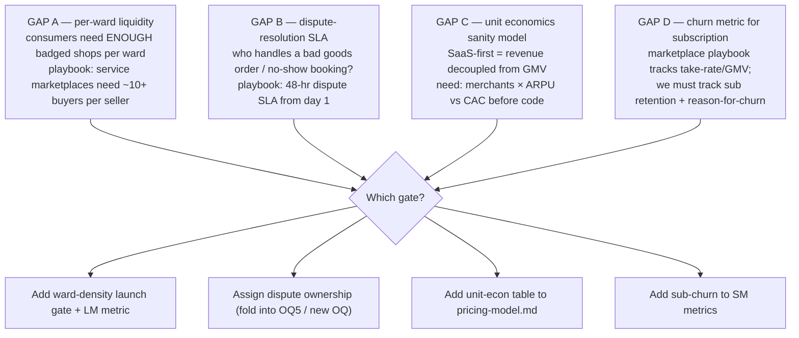
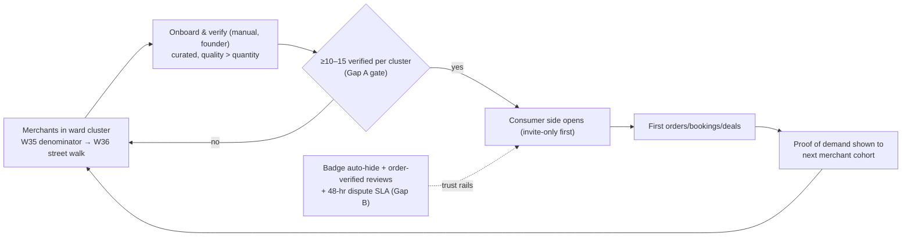

# Marketplace Audit — cold-start, liquidity, trust & unit economics (skill-assisted)

> **Date:** 2026-09-08 · **Method:** India Business OS plan audited against the `marketplace-platform-builder` skill (two-sided platform playbook: cold-start, liquidity, trust & safety, unit economics, fee architecture).
> **Verdict:** our design already matches the playbook on **cold-start sequencing** (supply-first + ≥100 gate = the playbook's "seed 100 quality listings before opening buyers"). The audit found **4 gaps** worth deciding before build. Each gap → a decision row, most map to existing OQs.

---

## 1. What the playbook confirms (already in our plan ✅)
| Playbook rule | Our equivalent | Status |
|---|---|---|
| "Seed supply side first; curated 100+ listings before any demand-side marketing" | ≥100 verified merchants gate before consumer launch (scope-brief; W35–W40 ramp) | ✅ designed |
| "Cold-start is #1 killer — die from it, not feature gaps" | Waves A supply-first sequencing; pilot ward-cluster approach | ✅ designed |
| "Verified-purchase-only reviews from day 1" | Order-verified ratings (domain D6) | ✅ designed |
| "Trust & safety is a budget line from day 1, not an afterthought" | Badge auto-hide, order-verified reviews, LM2 weekly audit | ✅ mostly — **Gap B** below |
| "Local payment rails for expansion" | UPI via PA redirect; pay-at-shop for services (no escrow) | ✅ designed |

## 2. Gaps found (decision needed)

| # | Gap | Why it matters | Decision options | Our lean | Owner |
|---|---|---|---|---|---|
| **A** | **Per-city + per-cluster liquidity** — the ≥100-per-city gate doesn't guarantee density *within* a ward cluster | 100 shops spread across a city (Bengaluru or Hyderabad) = empty-feeling consumer app; playbook: buyers/sellers >10:1 per geography | (1) gate on ≥X badged shops *per pilot ward-cluster*, (2) launch consumers only in clusters that hit it, (3) accept thin start | **Cluster gate**: ≥10–15 verified shops per launch cluster (target metric, e.g. LM3); two cities → double the field cost, so the cluster gate matters even more | founder + W39 |
| **B** | **Dispute-resolution SLA** — who resolves a bad order/no-show, and in what time | Trust is the product; one viral "scammed" story kills 6–12 months of growth | (1) in-app dispute flow with 48-hr founder-mediated SLA in pilot (manual), (2) rely on order-verified reviews + badge auto-hide only, (3) PA chargeback route for goods | **Manual 48-hr pilot SLA** (order-level disputes), folded with OQ5 no-show/deal rules | founder |
| **C** | **Unit-economics sanity model** (pre-code) | SaaS-first means revenue = merchants × ARPU × retention, *not* GMV×take-rate — the playbook's fee math doesn't apply, so we need our own number check before build spend | (1) simple table: activation funnel × ₹/mo × churn vs CAC/ops cost; (2) defer until interviews give WTP | **Add table to `docs/pricing-model.md`** after H4 ladder results; pre-build sanity: breakeven merchant count at ₹99–149/mo | founder |
| **D** | **Subscription churn metric** | Marketplaces optimize liquidity; SaaS marketplaces must also optimize retention — "calendar value" must be re-proven monthly | (1) add sub-churn + churn-reason to SM metrics; (2) track D30/D90 renewal after paid pilot | **Add SM7–SM8** (sub-churn, churn reason) once paid pilot starts | founder |

## 3. The cold-start flow we are committing to (from the playbook)

Sequencing notes (playbook-consistent): manual curation → invite-only demand → public launch · supply quality over count · trust rails live *before* first consumer (not after) · each ward cluster repeats the loop — scale = more clusters, not a wider thin launch.

## 4. Changes proposed to the docs (all optional, founder picks)
1. Add **LM3** ("X verified merchants in launch cluster" per cluster) + **SM7–SM8** (sub-churn, churn-reason) to `scope-brief.md` metrics.
2. Fold **Gap B** into OQ5 (deal rules + no-show) in `scope-brief.md` open questions.
3. Add the **unit-economics sanity table** to `docs/pricing-model.md` once H4 ladder results exist.
4. Note Gap A cluster gate in `docs/pilot-recruitment-playbook.md` / work-items W39.

## 5. Skill notes (for reuse)
- Audited with: `marketplace-platform-builder` (skill library at `/Users/sp.vm/Documents/Projects/Skills`).
- Caveat: the playbook is written for commission/take-rate marketplaces (Stripe Connect, escrow, 10:1 liquidity). Our **SaaS-first subscription model** deliberately diverges on revenue — which is exactly why Gap C (unit economics) and Gap D (churn) exist. Cold-start, trust, and liquidity rules transfer 1:1.
- Candidate next skills for the same audit pass: `saas-monetization-strategist` (OQ9 ladder/tiers), `enterprise-pricing-strategist`, `decision-engineer` (decision register quality), `ux-researcher` (H1–H6 scripts).
